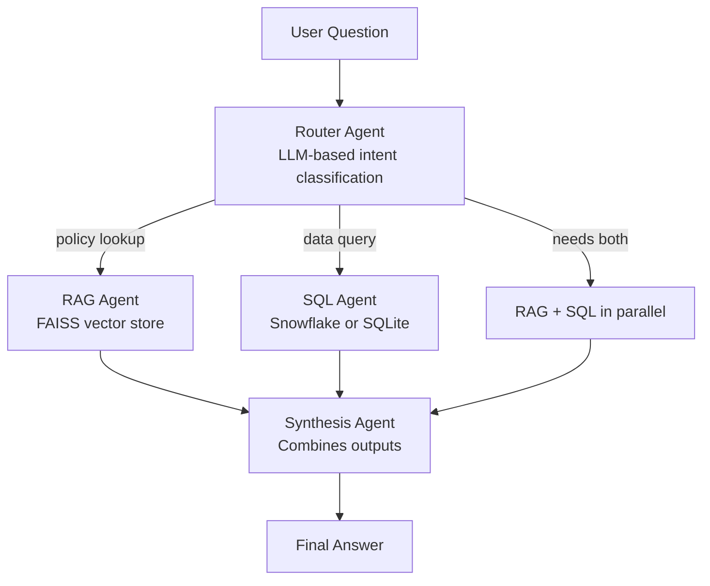

# Enterprise AI Analyst Agent

[Streamlit]
[LangChain]
[Snowflake]

### 🔗 [Try the live demo →](https://ai-bi-agent-enterprise-analyst.streamlit.app/)

*The live demo runs on an embedded SQLite database - no login or setup required. Ask a business question and watch the multi-agent pipeline route it through document search, live data querying, or both. The same codebase also runs against a live Snowflake data warehouse with key-pair authentication (used during local development).*

A multi-agent business intelligence assistant that answers natural language questions by orchestrating document retrieval (RAG) and live database queries (SQL) through LangGraph - built for the insurance and financial services domain.

## The Problem

Analysts at insurance and financial services firms routinely answer questions that span two disconnected systems: internal policy documents (PDFs, regulatory guidelines) and transactional data warehouses. A single business question like *"What's our claims escalation threshold, and how many current claims exceed it?"* requires manually searching documents AND writing SQL - often taking hours and involving multiple people.

This system answers that same question in under a minute, with the policy reference and live data in a single response.

## Architecture



**Router Agent** - classifies each question as needing document search, database query, or both

**RAG Agent** - retrieves relevant context from a FAISS vector store built from real insurance policy documents (NAIC regulatory guidelines, ISO commercial auto policy forms, Chubb's SEC 10-K filing, and an internal claims escalation policy). Uses local sentence-transformer embeddings - no document content sent to external APIs.

**SQL Agent** - writes and executes SQL through a dual-mode database connector (see below). Self-corrects on schema errors without human intervention. Constrained by a custom system prompt to prevent invented filter values.

**Synthesis Agent** - combines outputs from RAG and SQL into a single executive briefing. Critically, when the Router decides a question needs both sources, the RAG agent's findings are passed into the SQL agent's prompt as context - so dollar thresholds extracted from policy text drive the SQL query directly, instead of the SQL agent re-deriving the number.

## Dual-Mode Database - Snowflake + SQLite

This system implements both production and demo data access patterns in the same codebase:

| Mode | Used For | Authentication |
|---|---|---|
| **Snowflake (production)** | Local development, real deployments | Key-pair authentication (no password, no MFA prompts) via RSA private key |
| **SQLite (demo)** | Public Streamlit Cloud deployment, anyone cloning the repo | None - embedded file ships with the project |

The `db_connector.py` module auto-detects which mode to use: if Snowflake credentials and a private key path are present in environment variables, it connects to Snowflake using `snowflake-sqlalchemy` with the RSA key serialized into PKCS8 format. Otherwise, it falls back to a local SQLite file (`data/demo.db`) pre-loaded with the same dataset.

This separation matters for two reasons:

1. **Security** - the production key never gets uploaded to a public hosting platform. The live Streamlit demo cannot accidentally expose Snowflake credentials because they aren't there.
2. **Demo accessibility** - anyone reviewing this project can click the live link and use it instantly, without provisioning their own data warehouse.

The same insurance claims dataset (1,000 records, 39 fields) is loaded into both Snowflake and SQLite by the same loader script, so query results are identical across modes.

## Tech Stack

- **Orchestration:** LangChain, LangGraph (stateful multi-agent graphs)
- **LLM:** Groq API (Llama 3.3 70B)
- **Vector Store:** FAISS with `sentence-transformers/all-MiniLM-L6-v2` embeddings (runs locally)
- **Data Warehouse:** Snowflake with `snowflake-sqlalchemy` + RSA key-pair authentication
- **Demo Database:** SQLite (auto-fallback when Snowflake credentials are absent)
- **UI:** Streamlit (deployed on Streamlit Cloud)
- **Documents:** Real regulatory and corporate filings (NAIC, ISO, SEC EDGAR)

## Dataset

**Documents indexed (~470+ pages combined):**
- Chubb Ltd's SEC 10-K annual filing (corporate risk disclosures, financial reporting)
- NAIC Unfair Claims Settlement Practices Act (regulatory standards)
- ISO Business Auto Coverage Form CA 00 01 (policy contract language)
- Internal Claims Escalation Policy (approval thresholds and authority limits)

**Claims data:** 1,000 auto insurance claims (Kaggle dataset), 39 fields including claim amounts, fraud flags, incident types, severity, geography, vehicle details, and policy information.

## Key Engineering Decisions

- **Self-correcting SQL generation** - the SQL agent inspects schema errors, identifies correct column names, and rewrites queries autonomously rather than failing
- **No-hallucination policy** - when data genuinely isn't available, the system reports that honestly instead of fabricating an answer
- **Cross-agent context passing** - facts extracted by the RAG agent (e.g. dollar thresholds from policy text) are passed into the SQL agent's query generation step, so numeric values found in unstructured documents drive structured queries correctly
- **Constrained SQL prompting** - a custom system prefix prevents the SQL agent from inventing filter values that don't exist in the schema (a common LLM failure mode)
- **Local embeddings** - no external API calls for document embedding, relevant for data-sensitive regulated industries
- **Dual-mode data layer** - auto-detects production vs demo environment, no code branching required at call sites

## Running Locally

**Demo mode (no credentials required):**

```bash
git clone https://github.com/Nishant-Chaudhari-07/ai-bi-agent.git
cd ai-bi-agent
python -m venv venv
venv\Scripts\activate
pip install -r requirements.txt
streamlit run app.py
```

The app runs in SQLite demo mode automatically.

**Production mode (with live Snowflake):**

Add to a `.env` file in the project root:

GROQ_API_KEY=your_groq_key

SNOWFLAKE_USER=your_user

SNOWFLAKE_ACCOUNT=your_account

SNOWFLAKE_DATABASE=your_database

SNOWFLAKE_SCHEMA=PUBLIC

SNOWFLAKE_WAREHOUSE=COMPUTE_WH

SNOWFLAKE_PRIVATE_KEY_PATH=snowflake_private_key.pem

Generate the RSA key pair and register the public key with your Snowflake user, then run:

```bash
python db_connector.py    # loads data into both Snowflake and SQLite
streamlit run app.py
```

The connector auto-detects credentials and switches to Snowflake mode.

## Project Context

This is the second of two agentic AI projects built to demonstrate production-pattern multi-agent system design for business intelligence use cases. The first project, an AI-powered churn and revenue risk analyzer, focused on scheduled automation and LLM summarization. This project extends that into interactive, multi-step agent orchestration with retrieval-augmented generation and live data querying.

Built by **Nishant Chaudhari** - [Portfolio](https://nishantchaudhari.com) · [LinkedIn](https://linkedin.com/in/nishant-chaudhari)

**Production mode (with live Snowflake):**

Add to a `.env` file in the project root:
